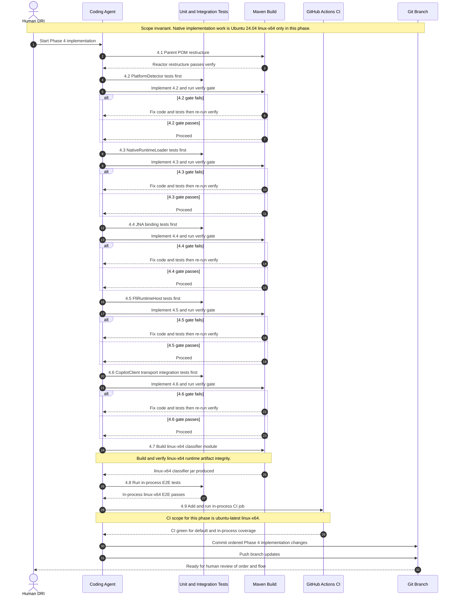

# Phase 4 Sequence Diagram

```mermaid
sequenceDiagram
    autonumber
    actor DRI as Human DRI
    participant Agent as Coding Agent
    participant Tests as Unit and Integration Tests
    participant Build as Maven Build
    participant CI as GitHub Actions CI
    participant Repo as Git Branch

    Note over DRI,Repo: Scope invariant. Native implementation work is Ubuntu 24.04 linux-x64 only in this phase.
    DRI->>Agent: Start Phase 4 implementation

    Agent->>Build: 4.1 Parent POM restructure
    Build-->>Agent: Reactor restructure passes verify

    Agent->>Tests: 4.2 PlatformDetector tests first
    Agent->>Build: Implement 4.2 and run verify gate
    alt 4.2 gate fails
        Build-->>Agent: Fix code and tests then re-run verify
    else 4.2 gate passes
        Build-->>Agent: Proceed
    end

    Agent->>Tests: 4.3 NativeRuntimeLoader tests first
    Agent->>Build: Implement 4.3 and run verify gate
    alt 4.3 gate fails
        Build-->>Agent: Fix code and tests then re-run verify
    else 4.3 gate passes
        Build-->>Agent: Proceed
    end

    Agent->>Tests: 4.4 JNA binding tests first
    Agent->>Build: Implement 4.4 and run verify gate
    alt 4.4 gate fails
        Build-->>Agent: Fix code and tests then re-run verify
    else 4.4 gate passes
        Build-->>Agent: Proceed
    end

    Agent->>Tests: 4.5 FfiRuntimeHost tests first
    Agent->>Build: Implement 4.5 and run verify gate
    alt 4.5 gate fails
        Build-->>Agent: Fix code and tests then re-run verify
    else 4.5 gate passes
        Build-->>Agent: Proceed
    end

    Agent->>Tests: 4.6 CopilotClient transport integration tests first
    Agent->>Build: Implement 4.6 and run verify gate
    alt 4.6 gate fails
        Build-->>Agent: Fix code and tests then re-run verify
    else 4.6 gate passes
        Build-->>Agent: Proceed
    end

    Agent->>Build: 4.7 Build linux-x64 classifier module
    Note over Agent,Build: Build and verify linux-x64 runtime artifact integrity.
    Build-->>Agent: linux-x64 classifier jar produced

    Agent->>Tests: 4.8 Run in-process E2E tests
    Tests-->>Agent: In-process linux-x64 E2E passes

    Agent->>CI: 4.9 Add and run in-process CI job
    Note over Agent,CI: CI scope for this phase is ubuntu-latest linux-x64.
    CI-->>Agent: CI green for default and in-process coverage

    Agent->>Repo: Commit ordered Phase 4 implementation changes
    Agent->>Repo: Push branch updates
    Repo-->>DRI: Ready for human review of order and flow
```
